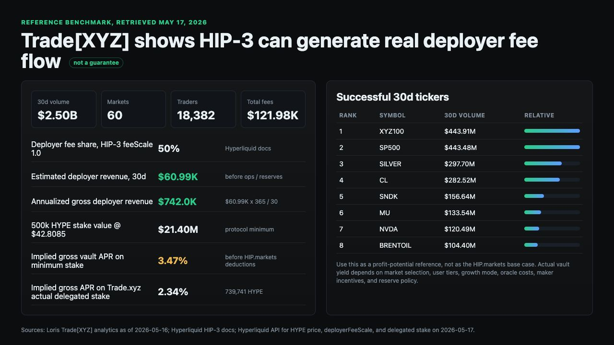
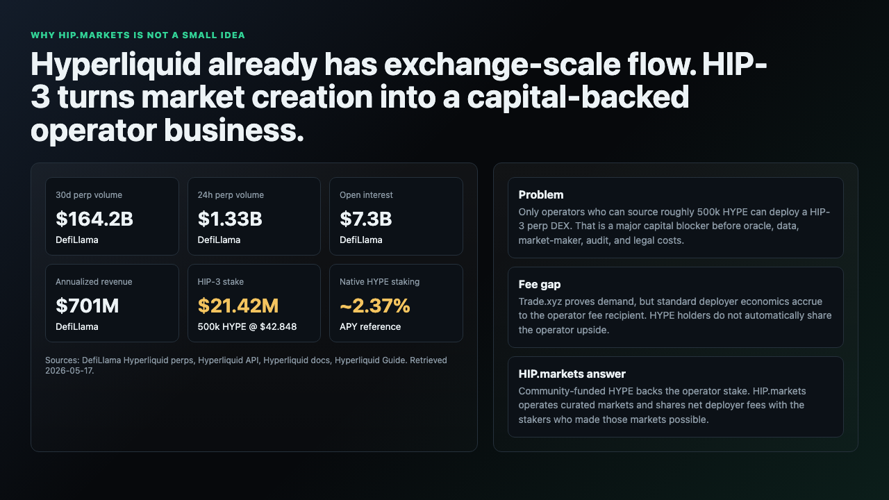
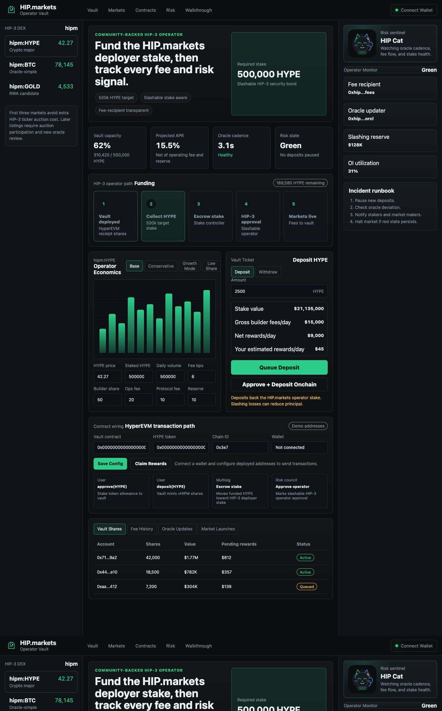
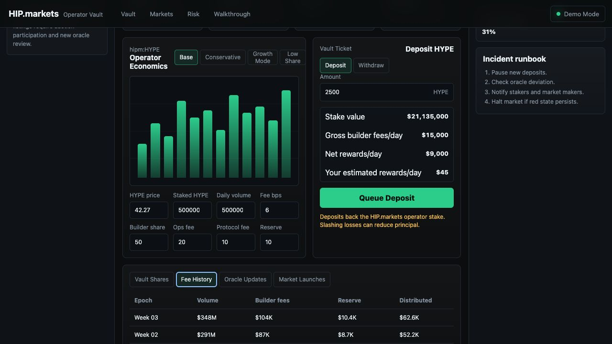
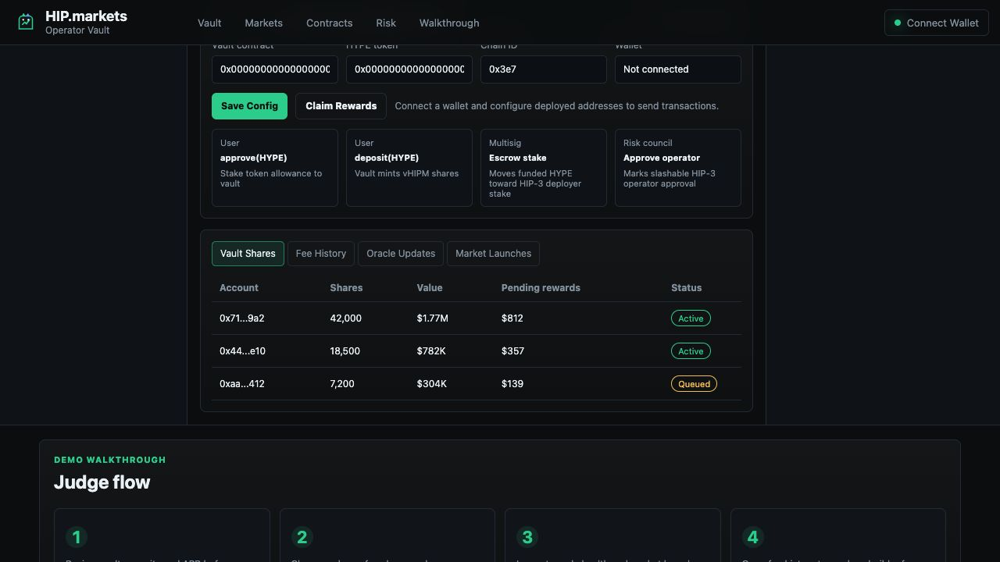

<p align="center">
  
</p>

<p align="center">
  <strong>Community-backed HIP-3 markets on Hyperliquid.</strong><br />
  Fund the operator stake. Share the builder fees. Keep risk visible.
</p>

<p align="center">
  <a href="docs/JUDGING_GUIDE.md"><strong>Judging Guide</strong></a>
  ·
  <a href="presentation/HIP_MARKETS_DECK.md"><strong>Pitch Deck</strong></a>
  ·
  <a href="docs/DEPLOYMENT_AND_SECURITY_PLAN.md"><strong>Security Plan</strong></a>
</p>

# HIP.markets

HIP.markets pools HYPE from users on HyperEVM so the HIP.markets team can satisfy the 500,000 HYPE stake requirement to operate its own HIP-3 builder-deployed perpetual DEX. In return, HYPE stakers receive a transparent share of deployer trading fees generated by HIP.markets-operated markets.

This submission is intentionally not framed as generic liquid staking. HIP.markets is an exchange operator with a vault layer: users are backing the HIP.markets DEX, oracle operations, liquidity program, market risk controls, and fee-sharing system.

## Why This Exists

Hyperliquid is already a top-tier onchain derivatives venue, not an empty ecosystem. In the latest demand snapshot, DefiLlama showed Hyperliquid Perps at roughly `$164B` 30-day perp volume, `$7.3B` open interest, `$775.7M` annualized fees, and `$701.1M` annualized revenue.

HIP-3 turns that exchange infrastructure into open market-operator infrastructure. Any qualified builder can deploy a perp DEX, but the blocker is severe: Hyperliquid docs specify a **500,000 HYPE mainnet staking requirement** for one HIP-3 perp DEX. Using the 2026-05-17 Hyperliquid API HYPE price check of `$42.848`, that stake is roughly **$21.42M** before oracle, data, market-maker, audit, legal, and operating costs.

At the same time, ordinary HYPE staking is low-yield by comparison. Current liquid-staking references put HYPE staking around **2.37% APY**. HIP.markets is therefore not trying to replace staking with "free yield." It creates a different, higher-risk category: HYPE holders can back a market operator and share net deployer fees from markets they help enable.

Trade.xyz shows the opportunity and the gap. Trade[XYZ] proves HIP-3 can attract real trading demand, but the standard deployer model routes deployer fees to the operator fee recipient. HIP.markets changes that incentive design: community HYPE funds the 500k stake, HIP.markets operates the markets, and net deployer fees can flow back to the stakers who made the operator possible.

## Hackathon Submission

- **Project:** HIP.markets
- **Category:** Hyperliquid / HyperEVM / HIP-3
- **Tagline:** Fund the market operator. Share the builder fees.
- **Core primitive:** HYPE vaults backing HIP.markets' own HIP-3 deployer stake
- **Submission status:** Prototype, product spec, deeper reference contracts, wallet-aware demo, docs, and pitch deck

## What Is Included

```text
app/                         Static frontend demo and APR calculator
contracts/                   Reference Solidity vault and registry contracts
data/                        Example economics and market scenarios
docs/                        Business, product, architecture, oracle, and risk docs
presentation/                Hackathon pitch deck markdown
scripts/                     Small validation and model scripts
src/                         Economic model used by the demo and tests
tests/                       Node.js tests for the economic model
```

## Quick Start

No install is required for the core demo.

```bash
npm test
npm run validate
npm run serve
```

Then open:

```text
http://localhost:4173/app/
```

You can also open `app/index.html` directly in a browser.

## Presentation Highlights

### Walkthrough Video

An upload-ready narrated hackathon walkthrough is included at [presentation/walkthrough/HIP_MARKETS_WALKTHROUGH.mp4](presentation/walkthrough/HIP_MARKETS_WALKTHROUGH.mp4). The narration script and YouTube upload copy are included in [presentation/walkthrough/HIP_MARKETS_WALKTHROUGH_SCRIPT.md](presentation/walkthrough/HIP_MARKETS_WALKTHROUGH_SCRIPT.md) and [presentation/walkthrough/YOUTUBE_UPLOAD_COPY.md](presentation/walkthrough/YOUTUBE_UPLOAD_COPY.md).

To rebuild it locally:

```bash
npm run build:walkthrough
```

### Trade.xyz Reference Economics

Trade[XYZ] is used as the dated reference case for profit potential, not as a guaranteed HIP.markets base case. The snapshot below shows a public 30-day benchmark: `$2.50B` volume, `60` listed markets, `$121.98K` total fees, an estimated `$60.99K` deployer share before operating costs, and `3.47%` gross implied APR on the 500,000 HYPE minimum stake.



Supporting math and source notes are in [presentation/REFERENCE_CALCULATIONS.md](presentation/REFERENCE_CALCULATIONS.md).

### Hyperliquid Market Context

Judges should understand why the addressable market is large before they evaluate the product. Hyperliquid's scale, the 500k HYPE requirement, and the low baseline staking APY are the setup for HIP.markets.



### Demo Operator Console

The demo opens directly into the operator vault, not a marketing landing page. It shows the launch rail, 500,000 HYPE stake requirement, APR model, deposit ticket, oracle cadence, risk state, and operator monitor in one trading-terminal-style workflow.



### Proof Console And Beta Readiness

The app now includes a proof console that separates what is live, what is simulated, and what must be proven before deposits: deployed addresses, fee-recipient verification, first-three-market readiness, beta HYPE commitments, and remaining launch blockers.

### Brand And Mascot

HIP.markets now has an original terminal-native brand system and a cat mascot, **HIP Cat**, positioned as the risk sentinel for the operator vault. The mascot nods to Hyperliquid's cat culture without copying Hyperliquid's marks or Hypurr assets.

<p align="center">
  
</p>

### Fee Ledger And Audit Flow

The vault UI includes an inspectable fee-history panel so stakers can see how market volume, builder/deployer fees, reserve contributions, and distributions are meant to connect.



### Contract Connectivity

The app can stay in safe demo mode, but it now exposes the actual transaction path needed after deployment: configure HyperEVM vault and HYPE token addresses, connect a wallet, approve HYPE, deposit into the vault, and show the operator/multisig actions that move funded HYPE toward HIP-3 slashable operator approval.



## Core User Flow

1. User deposits HYPE into the HIP.markets vault on HyperEVM.
2. User receives vault shares.
3. The vault allocates HYPE toward the HIP.markets HIP-3 deployer stake.
4. Once 500,000 HYPE is funded, the operator multisig escrows stake to the deployer stake controller.
5. The risk council records HIP-3 operator approval and markets-live status.
6. HIP.markets launches and operates HIP-3 markets.
7. HIP.markets runs oracle relayers, risk controls, market-maker programs, and monitoring.
8. Deployer fees accrue to the HIP.markets fee recipient.
9. Net fees are distributed to vault stakers after operating fees, protocol fees, and reserve contributions.

## Why This Matters

HIP-3 lets builders deploy perpetual DEXs on Hyperliquid, but one HIP-3 DEX requires 500,000 HYPE staked. That is a large capital requirement for a market operator. HIP.markets lets HYPE holders fund the operator stake and participate in the economics of the markets they help secure.

The opportunity is not "stake HYPE and forget it." The opportunity is to build a disciplined, transparent, community-backed market operator with:

- public fee accounting;
- oracle health monitoring;
- market risk disclosures;
- slashing reserve policy;
- conservative market launches;
- clear fee-sharing terms.

## Documentation

- [Business and Product Spec](docs/BUSINESS_PRODUCT_SPEC.md)
- [Technical Architecture](docs/ARCHITECTURE.md)
- [Brand System](docs/BRAND_SYSTEM.md)
- [Enhancement Prompt](docs/ENHANCEMENT_PROMPT.md)
- [Judging Guide](docs/JUDGING_GUIDE.md)
- [Deployment and Security Plan](docs/DEPLOYMENT_AND_SECURITY_PLAN.md)
- [Deployment Proof Checklist](docs/DEPLOYMENT_PROOF_CHECKLIST.md)
- [First Three Markets Memo](docs/FIRST_THREE_MARKETS_MEMO.md)
- [Hyperliquid Demand Research](docs/HYPERLIQUID_DEMAND_RESEARCH.md)
- [Market Context](docs/MARKET_CONTEXT.md)
- [Jeff Yan-Inspired Review](docs/JEFF_YAN_REVIEW.md)
- [Investor Critical Review And Execution Plan](docs/INVESTOR_CRITICAL_REVIEW_AND_EXECUTION_PLAN.md)
- [Oracle Operations Plan](docs/ORACLE_OPERATIONS.md)
- [Risk Register](docs/RISK_REGISTER.md)
- [UI/UX Research Notes](docs/UI_UX_RESEARCH.md)
- [Hackathon Submission Summary](docs/HACKATHON_SUBMISSION.md)
- [Repo Polish Audit](docs/POLISH_AUDIT.md)
- [Pitch Deck](presentation/HIP_MARKETS_DECK.md)

## Prototype Components

### Frontend Demo

The static demo in `app/` shows a terminal-style operator vault interface inspired by trade.xyz's documented trading workflow:

- HYPE stake requirement;
- assumed HYPE price;
- daily volume;
- effective fee rate;
- deployer share;
- operating cost;
- reserve contribution;
- estimated distributable APR;
- market launch rail;
- deposit/withdraw ticket;
- fee history tabs;
- oracle health table;
- operator risk monitor;
- wallet connection;
- configurable vault and HYPE token addresses;
- `approve(HYPE)`, `deposit(uint256)`, and `claimRewards()` transaction path;
- operator lifecycle from funding to HIP-3 approval and markets live.

### Economic Model

The model in `src/model.js` powers the calculator and tests. It is deliberately simple and reviewable.

### Reference Contracts

The Solidity contracts are reference implementation scaffolds:

- `HipMarketsVault.sol`: ERC-20-style receipt shares, deposits, withdrawal queue, operator lifecycle, stake-controller escrow, reward accounting, protocol/reserve accounting, slashing loss accounting, and two-step ownership transfer.
- `HipMarketsRegistry.sol`: operator metadata, launch checklist, market metadata, oracle health, fee epochs, role-separated reporters, risk state, and fee-recipient transparency.

These contracts are not audited and should not be deployed with user funds without a full security review.

## Current Assumptions

- HIP.markets is the HIP-3 operator in the MVP.
- User HYPE backs the HIP.markets deployer stake.
- The first launch should use one DEX and the first three markets to avoid extra HIP-3 ticker auction costs.
- Rewards should start as weekly USDC distributions or HYPE distributions after clear accounting.
- Some HIP-3 deployer actions may still require off-chain/API-wallet execution.
- Fee routing and deployer custody must be verified before production.
- The current app can send wallet transactions only after real HyperEVM contract addresses are configured.
- HIP-3 stake submission is modeled as a controller/multisig handoff until native delegated staking or full HyperEVM control is proven.

## Validation Checklist

- [x] Product spec
- [x] Demo calculator
- [x] Reference contracts
- [x] Risk register
- [x] Oracle operations plan
- [x] Presentation deck source
- [x] Economic model tests
- [ ] Live HyperEVM deployment
- [ ] Audited contracts
- [ ] Signed market-maker commitments
- [ ] Final legal review
- [ ] Production oracle provider contracts

## Disclaimer

This is a hackathon prototype. HIP-3 deployer stake is slashable, fee revenue is variable, oracle operations are complex, and vault shares may create legal and regulatory issues. Nothing in this repository is financial, legal, or investment advice.
