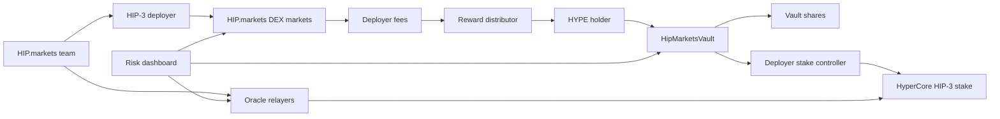

# Technical Architecture

## System Overview

HIP.markets has four layers:

1. HyperEVM vault layer.
2. HIP.markets HIP-3 deployer operations.
3. Fee accounting and distribution.
4. Oracle, market, and risk monitoring.

## Contracts

### HipMarketsVault

Responsibilities:

- accept HYPE deposits;
- issue ERC-20-style vault receipt shares (`vHIPM`);
- track proportional share price through deposits, withdrawals, reward distributions, and slash losses;
- queue withdrawals with a fixed protocol delay;
- model the operator lifecycle from funding to stake-ready, stake-escrowed, operator-approved, markets-live, wind-down, and slashed states;
- escrow funded HYPE to a deployer stake controller once the 500,000 HYPE requirement is met;
- record stake returns and slash losses;
- distribute rewards after protocol-fee and slashing-reserve accounting;
- pause deposits or withdrawals during incidents.

MVP assumptions:

- HYPE is represented by an ERC-20-compatible stake asset on HyperEVM or wrapped HYPE.
- Reward asset may be USDC or HYPE.
- Allocation to HyperCore may require an off-chain controller or multisig until full HyperEVM-to-HyperCore control is verified.
- `escrowStakeToController()` is therefore a reference handoff point, not proof that HyperCore HIP-3 staking can be fully contract-controlled today.

### HipMarketsRegistry

Responsibilities:

- publish HIP.markets deployer address;
- publish oracle updater address;
- publish fee recipient;
- publish vault and deployer stake requirement;
- publish operator lifecycle status and risk state;
- publish launch checklist completion;
- publish market metadata;
- publish oracle health;
- publish fee epochs;
- publish risk disclosures.

The registry is meant to make the operating state auditable to users and judges.

### HyperEVM App Connectivity

The frontend now has a minimal EIP-1193 transaction path:

1. User connects a wallet.
2. User configures deployed vault, HYPE token, and target chain ID.
3. User sends `approve(HYPE)` to the stake token.
4. User sends `deposit(uint256)` to `HipMarketsVault`.
5. Operator multisig calls `escrowStakeToController()` after the vault reaches 500,000 HYPE and the risk checklist is complete.
6. Risk council records operator approval and markets-live status.
7. Users can call `claimRewards()` after distributions are posted.

This keeps the demo honest: deposits and claims can be user transactions once deployed, while HIP-3 stake submission and operator approval still require controlled operator execution until native delegated HIP-3 staking is validated.

## Off-Chain Services

### Oracle Relayers

Relayers compute and publish HIP-3 oracle updates. They should run with:

- geographically distributed instances;
- hot/warm failover;
- signing key isolation;
- stale-price checks;
- data-source quorum rules;
- paging and alerting.

### Fee Accounting Service

The fee accounting service reconciles:

- Hyperliquid API volume and fee data;
- fee-recipient balances;
- manual operator reports;
- reward distribution transactions.

MVP distribution can be weekly and semi-automated. Production should move toward provable fee routing.

### Risk Monitor

The monitor tracks:

- oracle update intervals;
- price deviation;
- mark/oracle divergence;
- open interest caps;
- funding anomalies;
- liquidations;
- trading halts;
- market-maker depth;
- deployer key actions.

## Trust Assumptions

The MVP is not fully trustless. HIP.markets may need a team-controlled deployer, oracle updater, and fee recipient while HyperEVM/HyperCore automation is verified.

Trust is minimized through:

- public addresses;
- vault caps;
- weekly reports;
- controlled fee recipient;
- public registry;
- risk dashboard;
- multisig controls;
- emergency pause;
- slashing reserve.

## Production Hardening

Before production deposits:

- audit vault contracts;
- verify HYPE transfer and staking mechanics between HyperEVM and HyperCore;
- verify fee-recipient routing;
- define deployer key custody;
- build full oracle redundancy;
- obtain legal review;
- publish operator runbooks;
- run capped private beta.
