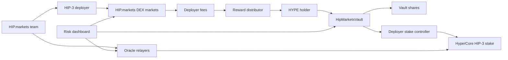

# Technical Architecture

## System Overview

HIP.markets has four layers:

1. HyperEVM vault layer.
2. HIP.markets HIP-3 deployer operations.
3. Fee accounting and distribution.
4. Oracle, market, and risk monitoring.

## Contracts

### HipMarketsVault

Responsibilities:

- accept HYPE deposits;
- issue vault shares;
- queue withdrawals;
- record stake allocation;
- record slash losses;
- distribute rewards;
- pause deposits or withdrawals during incidents.

MVP assumptions:

- HYPE is represented by an ERC-20-compatible stake asset on HyperEVM or wrapped HYPE.
- Reward asset may be USDC or HYPE.
- Allocation to HyperCore may require an off-chain controller until full HyperEVM-to-HyperCore control is verified.

### HipMarketsRegistry

Responsibilities:

- publish HIP.markets deployer address;
- publish oracle updater address;
- publish fee recipient;
- publish market metadata;
- publish oracle health;
- publish risk disclosures.

The registry is meant to make the operating state auditable to users and judges.

## Off-Chain Services

### Oracle Relayers

Relayers compute and publish HIP-3 oracle updates. They should run with:

- geographically distributed instances;
- hot/warm failover;
- signing key isolation;
- stale-price checks;
- data-source quorum rules;
- paging and alerting.

### Fee Accounting Service

The fee accounting service reconciles:

- Hyperliquid API volume and fee data;
- fee-recipient balances;
- manual operator reports;
- reward distribution transactions.

MVP distribution can be weekly and semi-automated. Production should move toward provable fee routing.

### Risk Monitor

The monitor tracks:

- oracle update intervals;
- price deviation;
- mark/oracle divergence;
- open interest caps;
- funding anomalies;
- liquidations;
- trading halts;
- market-maker depth;
- deployer key actions.

## Trust Assumptions

The MVP is not fully trustless. HIP.markets may need a team-controlled deployer, oracle updater, and fee recipient while HyperEVM/HyperCore automation is verified.

Trust is minimized through:

- public addresses;
- vault caps;
- weekly reports;
- controlled fee recipient;
- public registry;
- risk dashboard;
- multisig controls;
- emergency pause;
- slashing reserve.

## Production Hardening

Before production deposits:

- audit vault contracts;
- verify HYPE transfer and staking mechanics between HyperEVM and HyperCore;
- verify fee-recipient routing;
- define deployer key custody;
- build full oracle redundancy;
- obtain legal review;
- publish operator runbooks;
- run capped private beta.
